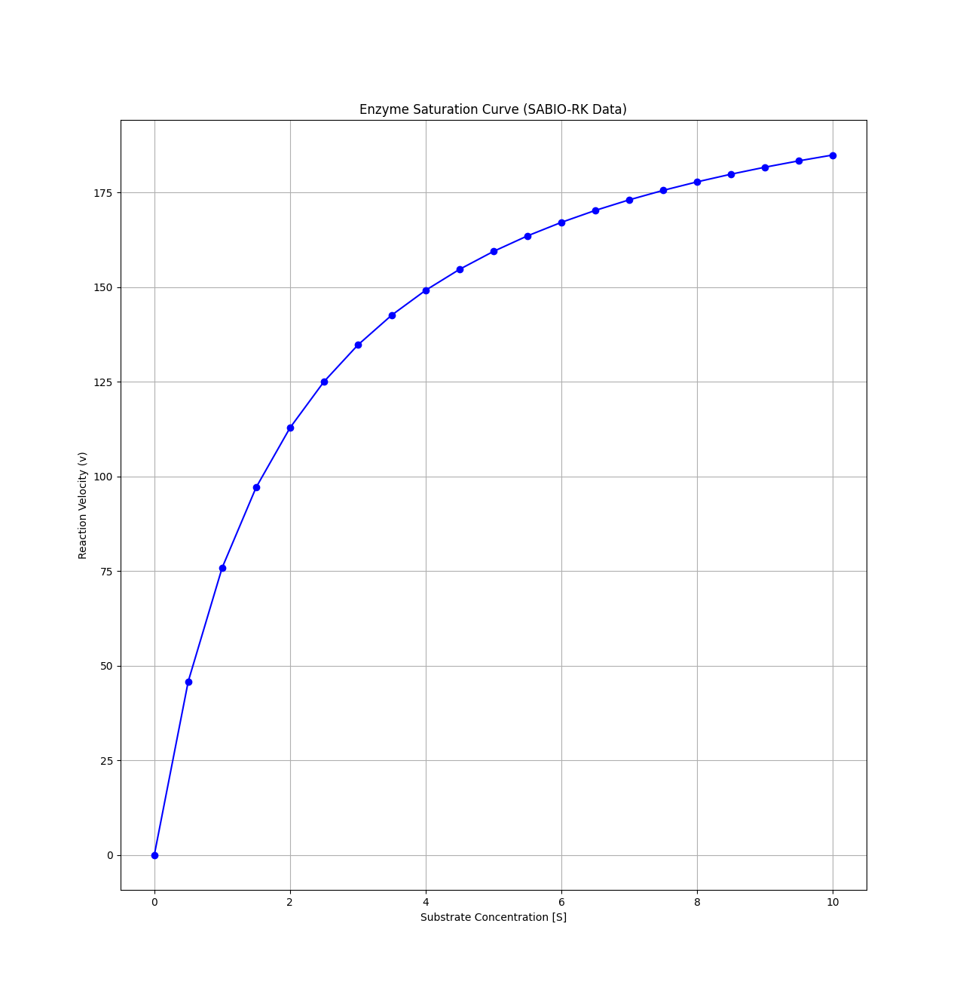

Problem: Getting kcat and  Km data parsing deeply nested data structures in a json file for specific enzymes without being bombarded by unneeded data, then converting values to find the Vmax.

Solution: Have python make an api call to SABIO-RK database to extract these specific properties then solve for Vmax using the Vmax = kcat$[E_t]$.

Figure example:
